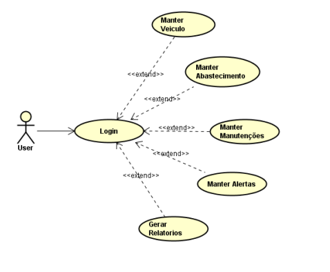
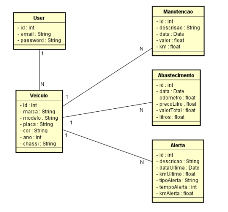
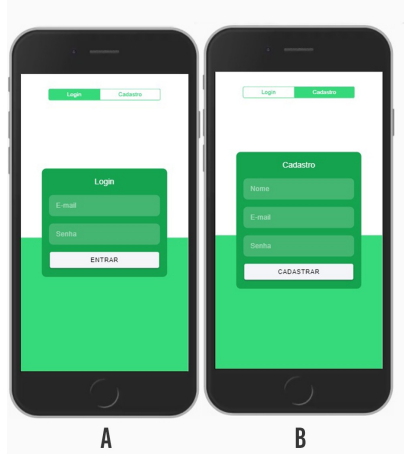
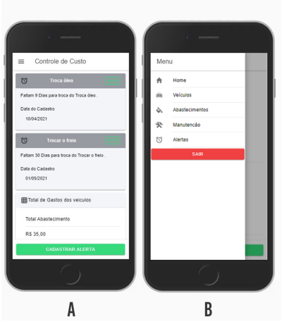
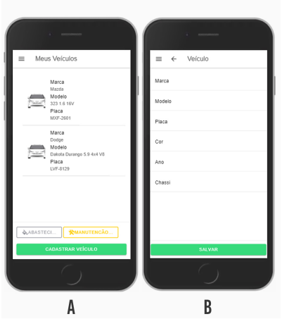
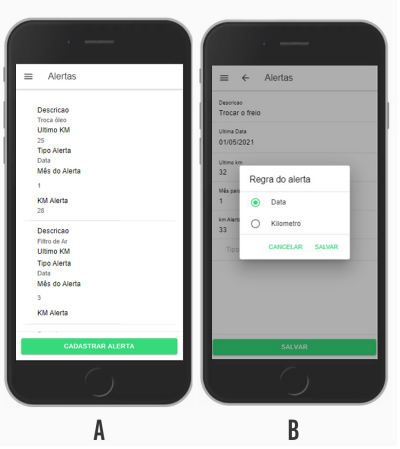

# Um PWA para Controle de Custos de Veículos utilizando ionic

## Introdução

Este trabalho apresenta um progressive web app (PWA) para controle de custos
de veículos do usuário. A ideia é proporcionar ao usuário uma maneira ágil
de registrar, pelo seu dispositivo móvel, todos os custos que são gerados pelo
seu veículo. Além disso, com algumas informações fornecidas inicialmente pelo
usuário, o app pode alertar sobre a necessidade de algum tipo de manutenção,
por exemplo, troca de óleo e filtros.

##  Diagrama de caso de uso 
 

##  Diagrama de classe

##   Aplicação - Tela de Login/Cadastro e Home
  

##   Aplicação - Tela de cadastro de veiculo e alertas

Na tela de Alertas, mostrada na Figura A, estão listadas todos os registros
de alertas configurados pelo usuário. Ao configurar um alerta o usuário informa: o
veículo, descrição do alerta, data da última realização, quilometragem da última
realização, regra do alerta (tempo ou km), informar número de meses para tipo
tempo e quilometragem para alerta no caso de tipo de alerta km. A Figura B
apresenta a tela de cadastro na seleção do tipo de regra do alerta.

